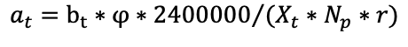
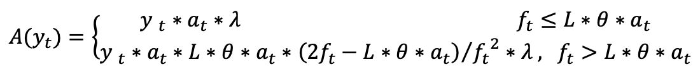
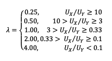
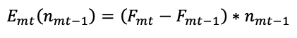

# CoFiX Product Documentation

## 1. Introduction

This is the design document of an implementation of the AMM model described in the white paper "[CoFiX, A computable financial transaction model](https://cofix.io/doc/CoFiX_White_Paper.pdf)". It describes mechanisms such as price calculation, trading, market making, exception handling and front-end interaction.

## 2. System role

| Role | Definition |
| :--- | :--- |
| Trader | The party that buys/sells on CoFiX and can be either an EOA or smart contract |
| Market maker | The party that participates in CoFiX market making is the counterpart of the trader. They provide liquidity for trades and can be either an EOA or smart contract. |
| Governor | The party that participates in the governance of the CoFiX system are the CoFiX governance token holders. The CoFiX system is modified and upgraded by voting with these tokens. In the early days it was governed by the developer admin account. |

## 3. Price calculation mechanism

### 3.1 Price source

The prices on the CoFiX exchange come from the NEST oracle. Each asset pool corresponds to a NEST oracle price pair.

Examples:

ETH-USDT asset pool, the price is from [NEST's ETH/USDT oracle](https://github.com/NEST-Protocol/NEST-oracle-V3).

### 3.2 Price compensation coefficient K

The risk of using a decentralized oracle like NEST is caused by the deviation of oracle prices and the delay between the current block and the block with the latest effective NEST price. CoFiX needs to compensate for this risk when quoting prices from NEST to ensure that the market maker is sufficiently incentivized to continue making the market. [Compensation factor](https://cofix.io/doc/Trading_Compensation_CoFiX.pdf) K is the coefficient related to the volatility rate δ and delay T. When a trader makes a transaction, he does not directly use price P but rather P' =P\*\(1+K\) \(or P' =P\*\(1-K\)\).

Similarly, when a market maker enters and exits the market, they use the price variable P' instead of P. This price is known as the transaction price.

The detailed calculation for this is shown in the [Trading Compensation of CoFiX](https://cofix.io/doc/Trading_Compensation_CoFiX.pdf).

### 3.3 Estimated price and execution price

Since a transaction in Ethereum requires a certain waiting time from initiation to execution, and the price of the NEST oracle is always in the updated state, there will be a certain difference between the price when the transaction is initiated and executed. Here we define the estimated price and execution price.

<table>
  <thead>
    <tr>
      <th style="text-align:left"></th>
      <th style="text-align:left"></th>
    </tr>
  </thead>
  <tbody>
    <tr>
      <td style="text-align:left">Estimated price: <b>Pes</b>
      </td>
      <td style="text-align:left">
        
The reference price seen by the user or market maker when initiating a
          trade is taken from the latest historical price from the NEST oracle.

        
This price is used by the front-end to display trading prices. This calculation
          factors in changes to the subscription pool share and the amount of assets
          to be redeemed.

      </td>
    </tr>
    <tr>
      <td style="text-align:left">Execution price: <b>Pex</b>
      </td>
      <td style="text-align:left">When the transaction is executed, the latest price of the NEST oracle
        is used in the trade.</td>
    </tr>
  </tbody>
</table>

The detailed calculation method for this is described below.

**Pd = \|Pex - Pes\|/Pes**

The transaction will revert if **Pd&gt;1%**.

## 4. Market maker mechanism

Market makers are the liquidity providers of CoFiX and earn income by providing liquidity for an asset pool. CoFiX supports unilateral asset market making, and handles asset management through the **net worth** and **share** of the fund in the corresponding asset pool.

### 4.1 Market maker share

**The XToken** represents the proportion of the asset pool owned by a market maker. As market makers put assets into the pool, they receive corresponding XTokens. When a market maker exits the pool, they do so by redeeming their XToken which entitles them to their share of the pool. XToken names follow XT1, XT2, XT3...

### 4.2 Asset pool creation and initialization

Anyone can choose a price pair from the NEST oracle to create a corresponding CoFiX asset pool.

Taking ETH-USDT as an example, when the market maker pool is created:

**Np** is the net worth of each share\(XToken\), it is represented by its ETH value: initially Np=1

The quantity of ETH market-making assets =**Ae**

The quantity of USDT market-making assets =**Au**

The initial amount of share\(XToken\) is S0:

### 4.3 Market maker net worth of each share\(XToken\), Np

**Np** is The net worth of each share\(XToken\) in an asset pool, it is represented by its ETH value.

Whenever there is a transaction, subscription, or redemption operation; Np is updated.

Taking the ETH-USDT asset pool as an example:

ETH-USDT asset pool total issuance share is **S \(The total amount of XToken\)**

The formula for calculating the asset pool’s net worth **Np** is:

### 4.4 Share\(XToken\) subscription

Subscription means participating in an asset pools market making and results in obtaining XToken of that pool.

Taking the ETH-USDT asset pool as an example:

Alice subscribes amount **a** of ETH to the ETH-USDT asset pool, and receives amount **s1** of the XToken.

Similarly, if Alice subscribes amount **b** of USDT to the ETH-USDT asset pool, she receives amount **s2** of the XToken.

### 4.5 Share redemption

Redemption means exiting a certain asset pool by redeeming the corresponding XTokens of that pool. Redemption entitles the market maker to receive either asset of a pair from the asset pool based on their share of the pool.

Taking the ETH-USDT asset pool as an example:

θ represents an extra transaction fee

c Alice redeems amount **c** of the XToken

Then the amount **e** of ETH that can be redeemed is:

The amount **u** of USDT that can be redeemed is:

## 5. Trading mechanism

### 5.1 ETH to ERC-20 transaction

Using ETH to exchange USDT and USDT to exchange ETH as an example:

Alice uses amount **a** of USDT to exchange amount **x** of ETH, the calculation is:

Alice uses amount **b** of ETH to exchange amount **y** of USDT, the calculation is:

### 5.2 ERC-20 to ERC-20 transactions

When there are multiple asset pools, a trader can complete the ERC-20 to ERC-20 exchange through a single transaction by calling 2 ETH-ERC-20 asset pools.

The calculation takes the process of Alice using USDT to exchange DAI as an example:

Suppose at this time

ETH/USDT oracle price = **P1**

ETH/USDT asset pool compensation factor =**K1**

ETH/DAI oracle price = **P2**

ETH/DAI asset pool compensation factor =**K2**

Then, when Alice uses amount **a** of USDT to exchange amount **y** of DAI, the calculation is:

Using amount **a** of USDT to exchange amount **x** of ETH

Using amount **x** of ETH to exchange amount **y** of DAI

Combine Steps 1 and 2

## 6. Additional risk control

### 6.1 Transaction delay

Considering that Ethereum has transaction congestion, the transaction may not be confirmed for a long time.

Therefore, after a transaction is initiated, there may be a large deviation between the settlement price and the estimated price when the transaction is initiated. Therefore, a variable is introduced, the transaction effective time **t**

1. When the transaction is initiated, the time is **t0**
2. When the transaction is successfully confirmed, the time is **t1**
3. Then, if **t1-t0  &gt; t** , the transaction will revert.
4. In the current setting, **t=600s**

### 6.2 Circuit breakers

According to the [Trading Compensation of CoFiX](https://cofix.io/doc/Trading_Compensation_CoFiX.pdf), if the volatility rate rises to an extreme level or the NEST system is attacked, CoFiX needs to activate an emergency procedure to protect both the trader and market maker.

The system should be able to trigger Circuit breakers when the following conditions are met:

1. The K0 value exceeds a range, K0&gt;5%
2. The volatility rate σ rises to a limit, σ&gt;0.1% per second
3. Delay T exceeds a range, T&gt;900s 

## 7. Token mining incentive system

Dividend and Governance, produced through liquidity mining.

### **7.1 G**eneral parameters**:**

#### **G**eneral Token Generation:

#### 0% pre-mined, 100% generated through mining

**CoFi Tokens are generated through the 3 mining pools:**

* **Mining pool A, the trading mining pool:** The token amount generated per TX is based on the extra fees collected from that TX, the token generation speed \(Token per block\) of the mining pool B, the total amount of the corresponding asset pool XToken participate in mining, and the Np \(net worth per share of the corresponding asset pool\) 
* **Mining pool B, the liquidity mining pool: bt** is the \_\*\*\_amount of CoFi tokens generated per block, bt ≥1, start with b0=4, the amount will be reduced by 20% for every 2,400,000 blocks and kept the integer only. For example b1=3, b2=2, b3=1, b4=1, b5=1, b6=1 ...
* **Mining pool C, the node mining pool\(Development team and early supporters\): ct** is the amount of CoFi tokens generated per block, ct = bt/9

**General token distribution:**

* 80% of the tokens generated from **Mining pool A** goes to traders, 10% goes to the liquidity providers

  of the corresponding asset pool, 10% goes to the nodes\(Development team and early supporters\).

* 100% of the tokens generated from **Mining pool B** goes to liquidity providers, distributed evenly per asset pool, liquidity providers can claim the tokens from the liquidity mining rewards pool based on the XToken amount they put in for liquidity mining.
* 100% of the tokens generated from **Mining pool C** goes to the nodes. Nodes can claim the tokens from the node rewards pool based on the node token amount they are holding. So the nodes always receive 10% of the total token generated through the 3 mining pools.

### **7.2 Details about the trading mining:**

#### **Token generation** mechanism**:**

In the TX of every trade, A\(yt\) amount of token is generated.

For trading TX t:

* The trading volume is Xt ETH, the extra fees collected from that TX t is Yt=Xt\*θ ETH
* The base amount of CoFi tokens generated for TX t is at

* **bt** is the token generation speed \(Token per block\) of the mining pool B
* **Xt** is the total amount of the corresponding asset pool XToken participate in mining
* **Np** is The net worth of each share\(XToken\) in an asset pool, it is represented by its ETH value.
* **q** is the number of asset pools
* **r = 0.3,** it is the expected return on market making assets
* φ is the mining factor for diffrerent asset pools, ETH-USDT is 2/3, ETH-HBTC is 1/3
* The actual amount of CoFo token generated for TX t is A\(yt\)

* The block interval between the trading TX t and the previous trading TX is s, the token density parameter is ft

* L is a threshold parameter, L = 100
* λ is a balance parameter to further help with the asset pool balance:

* Ux is the total asset value \(in ETH\) for asset X in trading pair X-Y, Uy is the total asset value \(in ETH\) for asset Y in trading pair X-Y

#### **Token distribution** mechanism**:**

For trading TX t:

* 80% A\(yt\) is distributed to the trader in the same trading TX
* 10% A\(yt\) = Ij\(yt\) is distributed to the corresponding liquidity mining rewards pool for liquidity providers to claim
* 10% A\(yt\) = R\(yt\) is distributed to the node rewards pool for nodes to claim

### **7.3** Details about the liquidity mining:

#### Token generation mechanism:

* bt is the amount of CoFi tokens generated per block, bt ≥1, start with b0=4, the amount will be reduced by 20% for every 2,400,000 blocks and kept the integer only. For example b1=3, b2=2, b3=1, b4=1, b5=1, b6=1 ...

#### **Token distribution** mechanism**:**

The market maker **m** claims CoFi token from the liquidity mining reward pool **j** through TX **t**:

* The CoFi token claim can be trigger by either claim TX, XToken deposit, or XToken withdraw TX. 
* The amount of CoFi token can be claimed through TX t is Bmt\(xmt-1\)

* **xmt-1** is the liquidity provider's XToken balance in liquidity mining reward pool **j** before TX t  _\*\*_
* **Gmt** is the mining factor for TX t, it represents how many CoFi the liquidity provider m can claim per XToken. **Gmtt** is read from the system variable **Gt**
* **Gmt-1** is the mining factor for previous TX done by the liquidity provider m

* There are amount **n** of asset pools participate in liquidity mining, the corresponding Xtoken are XT1, XT2... XTn. 
* G0 = 0 
* ht is the time of the TX t, ht-1 is the time of the previous claim, deposit, or withdraw TX
* The summation interval of ∑Ij\(Yi\) is ht to ht-1
* Xt is the total amount of XToken participate in the liquidity mining reward pool j when TX t is submitted 
* Ij\(yi\) is the amount of CoFi token received from the trading mining pool during between ht-1 to ht

### **7.4** Details about the node mining:

#### Token generation mechanism:

* ct is the amount of CoFi tokens generated per block, ct = bt/9

#### Token **distribution** mechanism:

* There are in total of 100 nodes\(100 CoFiX node tokens\)
* Nodes deposit CoFiX node tokens in node mining to claim CoFi tokens
* The CoFi token claim can be trigger by either a claim TX, a CoFiX node tokens deposit or XToken withdraw TX.

The node **m** claims CoFi token from the node reward pool through TX **t**:

* The amount of CoFi token can be claimed through TX t is cmt\(nmt-1\)

* ht is the time of the TX t, h\_t-1 is the time of the previous claim, deposit, or withdraw TX
* nmt-1 is m's balance of CoFiX node tokens in the node mining pool before TX t
* **Dmt** is the mining factor for TX t, it represents how many CoFi token the node m can claim per node token. Dmt is read from the system variable Dt
* **Dmt-1** is the mining factor for previous TX done by the node m

* The summation interval of ∑R\(yt\) is ht to ht-1
* R\(yt\) is the amount of CoFi token received from the trading mining pool during between ht-1 to ht
* Nt is the total amount of XToken participate in the node mining when TX t is submitted

### 7.5 CoFi token dividend and repurchase model：

All the extra fees \(in ETH\) collected from trading go in a saving pool, the percentage a of the total amount will be used for dividends, the percentage 1-a of the total amount will be used for repurchase.

#### The repurchase mechanism\(TBC by DAO\)

#### The dividend mechanism:

* CoFi token holders deposit CoFi  tokens in the dividend pool to claim CoFi tokens
* The ETH dividend claim can be trigger by either a claim TX, a CoFi token deposit TX, or a CoFi token withdraw TX.

CoFi token holder m makes a dividend claiming TX t:

* The total amount of ETH can be claimed in TX t is Emt\(nmt-1\)

* nmt-1 is m's balance of CoFi tokens in the dividend pool before TX t
* **Fmt** is the dividend factor for TX t, it represents how many ETH the CoFi token holder m can claim per CoFi token. Fmt is read from the system variable Ft
* **Fmt-1** is the dividend factor for previous TX done by the CoFi token holder m

* F0 = 0
* ∑y is the total amount of extra fees collected to the saving pool between ht to ht-1
* Nt is the total amount of CoFi token participate in the dividend pool when TX t is submitted

## 8. CoFiX DAO \(TBC\)

